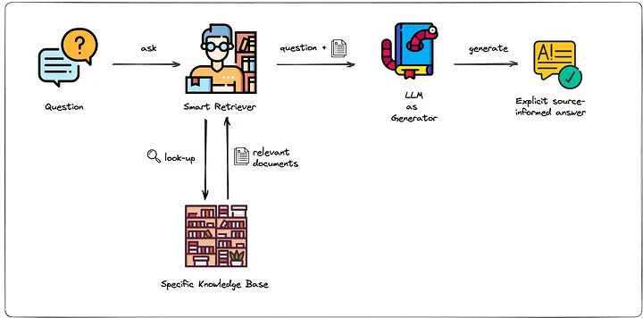
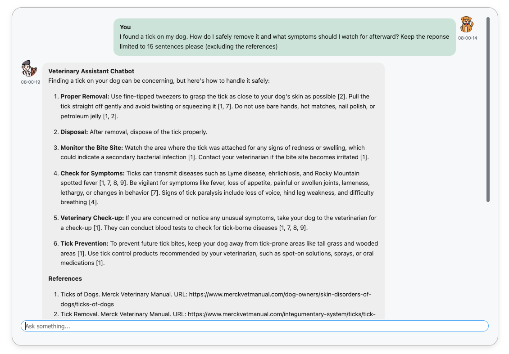

# AI for Animal Care


The era of large language models (LLMs) began in 2017 with the publication of *"Attention Is All You Need"* by Vaswani et al. [[1]](https://arxiv.org/abs/1706.03762). This groundbreaking paper introduced the transformer architecture, laying the foundation for a revolution in how machines process and generate human language. Since then, LLMs and generative AI more generally have rapidly evolved, powering applications that range from conversational agents to code generation and medical question answering.

Yet, despite their remarkable capabilities, generative models  are still underutilized across many sectors. Industry adoption often lags behind research advancements, and public awareness of their true potential remains limited. However, the landscape is changing fast — particularly as LLMs are increasingly integrated into intelligent agents, opening up transformative real-world applications.

One such opportunity was the **5-Day Generative AI Workshop** hosted by **Kaggle and Google**, which introduced participants to modern generative AI techniques. As part of the capstone project, I chose to build a **veterinary assistant chatbot**, powered by *Retrieval-Augmented Generation (RAG)* and grounded in authoritative content from the **Merck Veterinary Manual**.


## Why Veterinary Science?

Veterinary medicine — particularly in low-resource and rural regions — remains one of the fields where LLMs can make a significant impact. Access to up-to-date veterinary knowledge is often limited, and qualified professionals may be scarce. 
Therefore, many pet owners dont really understand their animals needs. 
They feed the wrong, sometimes harmful food, keep their dogs locked in cages the whole day and dont react appropropriately in times of medical emergence with potentially devastating consequences. 
Additionally, behavioral training often happens violently and the importance of vaccinations, sterilization and disease prevention are not understood.
Animal welfare suffers as a result, with growing street dog populations, preventable diseases, and misinformation contributing to systemic challenges.

A well-designed, AI-powered assistant that provides **reliable, verifiable, and scientifically grounded veterinary information** could support animal caretakers and educate the public about their animals. This could particularly make a difference when it comes to large street dog populations. Often poorly understood and feared they face hostility from locals and grow up in an environment of competition for and scarcity of food.
Additionally, most of these street dogs are not spayed or neutered, leading to uncontrolled population growth, increased hunger, disease transmission, and aggression.

In this article, we will explore how LLMs, paired with smart retrieval techniques, can serve as reliable, accessible veterinary assistants — even in low-resource environments.


## What This Project Covers

We will start to explore the process of retrieving the Merck Veterinary articles through Web Crawling and Scraping. 
Given the dataset, the next step involves the creation of a vector store ([**Chroma**](https://docs.trychroma.com/docs/overview/introduction)), which stores the different articles as vector embeddings that represent their meaning and content. 
After that, we will look at the creation of the chatbot, based on the [**Gemini API**](https://ai.google.dev/api?lang=python), that uses the vector store to answer users questions, based on the article content. This involves a combination of **Prompt Engineering** and the retrieval of relevant articles (see figure).


<figure>
  
  <figcaption>
    Retrieval Augmented Generation paired with Prompt Engineering can ground LLM output in authoritative content (<a href="https://blog.ml6.eu/leveraging-llms-on-your-domain-specific-knowledge-base-4441c8837b47" target="_blank">Source</a>).
  </figcaption>
</figure>

Finally, we quickly go through the User Interface, showcasing how it is designed to be both smoothly functioning as well as pleasant to work with and look at.

## Embedding the dataset in a Chroma database

Chroma is a popular and modern open-source **vector database**, meaning a database that stores content as numerical vector embeddings. Those embeddings represent the actual content and meaning of the data that is embedded, which makes them very useful and interesting in many applications. 
Most modern embedding algorithms are based on the transformer architecture and use a so called encoder-only variant thereof. In contrast to more traditional methods of language representation such as Bag of Words, these modern day methods are extremely sophisticated and powerful. 
In RAG settings, they allow us to search for articles that are relevant to a given user query, based on distance calculations of the article embedding and the querys embedding.

We start by retrieving the articles from GitHub and converting them into LangChain documents:

``` python
url = "https://raw.githubusercontent.com/JohannesSchulz97/WebScraper/refs/heads/main/data/merck-articles.json"

response = requests.get(url)
data = response.json()
...
documents = [
    Document(
        page_content=entry["content"],
        metadata={"name": entry["name"], "link": entry["link"]}
    )
    for entry in data
]
``` 

To then create the database, we first create a Chroma client, then the actual database and finally upload the documents in batches into that database: 

``` python
chroma_client = chromadb.Client()
...
db= chroma_client.get_or_create_collection(name="veterinary_articles", embedding_function=embed_fn)
...
db.add(
    documents=batch_docs,
    metadatas=batch_meta,
    ids=batch_ids
)
```
We use a custom embedding function that can embed both documents as well as user queries based on `text-embedding-004`, a powerful and modern text embedding architecture available on [Vertex Ai](https://cloud.google.com/vertex-ai/generative-ai/docs/embeddings/get-text-embeddings). 

## Prompt Engineering and document retrieval

The main idea of **Retrieval Augmented Generation (RAG)** is to augment a users query with additional relevant information that is retrieved from a vector store like Chrome. 
The enhancement or manipulation of a users is prompt is known as **Prompt Engineering**.
In addition to adding relevant articles from the Merck Veterinary Manual, we also add instructions to set the rules and the tone of the response. 

As can be seen in the code below, we define three types of queries. `QueryType.INITIAL` is only used once, namely the very first time the user interacts with the chatbot. 
Here we give very detailed and elaborate instructions, on how the responses should be structured. In multi-turn conversations, instructions can be forgotten due to **Context Window Limitations** or **Prompt Drifting**. Therefore, after every ten rounds of query-response between user and model, we remind the model of our initial instructions with a shorter reminder instruction prompt (`QueryType.REMINDER`). Every other query will not be augmented by any instructions, but just by the relevant articles (`QueryType.NO_INSTRUCTION`).

``` python

class QueryType(Enum):
    INITIAL = 1
    REMINDER = 2
    NO_INSTRUCTIONS = 3


initial_instruction_prompt = """You are a knowledgeable, friendly, and responsible veterinary chatbot 
designed to assist with questions related to veterinary science. 
...
If necessary, ask relevant and specific follow-up questions 
to gather additional information before making any conclusive statements or offering advice.
...

Always prioritize accuracy and caution in your responses. 
...

You will be given veterinary documents and their URLs. 
...
Your statements about veterinary science should only be based on the provided documents!
... """

reminder_instruction_prompt ="""..."""
...
```

We then retrieve the 10 most relevant articles given the users query through the `db.query()` method of Chroma. 
The final augmented query that is then fed to the language model consist of an optional instruction prompt, the users questions and in the end the URL, the name and the content of the retrieved articles. The URLs allow the model to specify the sources on which it bases its response and are therefore important for the user to be able to validate their correctness.

``` python
def retrieve_relevant_articles(query):
    embed_fn.document_mode = False
    results = db.query(query_texts=[query], n_results=10, include=['documents', 'metadatas'])
    [documents], [metadata] = results['documents'], results['metadatas']
    return [x['link'] for x in metadata], [x['name'] for x in metadata], documents
  

def augment_query(query, query_type: QueryType):
    query = query.replace("\n", " ")
    urls, names, documents = retrieve_relevant_articles(query)
    match query_type:
        case QueryType.INITIAL:
            prompt = initial_instruction_prompt + f"QUESTION: {query}\n\n"
        case QueryType.REMINDER:
            prompt = reminder_instruction_prompt + f"QUESTION: {query}\n\n"
        case QueryType.NO_INSTRUCTIONS:
            prompt = f"QUESTION: {query}\n\n"
    # Add the retrieved documents to the prompt.
    for url, name, document in zip(urls, names, documents):
        document = document.replace("\n", " ")
        prompt += f"url: {url}\n"
        prompt += f"name: {name}\n"
        prompt += f"document: {document}\n\n"
    return prompt
```

## Designing the User Interface

In designing the user interface, we focus on two main aspects. 
First, we want everything to work properly and smoothly, so that interacting with the chatbot is enjoyable and effortless. 
Secondly, the user interface should be pleasant to look at, again making it more enjoyable to work with it.
We use `ipywidgets` to implement the UI in jupyter
inspired by [this article](https://towardsdatascience.com/run-interactive-sessions-with-chatgpt-in-jupyter-notebook-87e00f2ee461/) of Konstantin Rink. 
The layout is kept minimal: a single scrollable chat window, a text input at the bottom, and a small loading animation to indicate processing.

To make the bot feel more alive, both user and bot messages are rendered as chat bubbles aligned to the left and right respectively, each with a timestamp and profile picture (using [icons created by Freepik – Flaticon](https://www.flaticon.com/free-icons/animal)). This is handled by formatting the HTML output of each message. 
Styling happens by injecting CSS code into the HTML frontend.
More details on UI design and styling can be found in the [source code](https://www.kaggle.com/code/johannesschulz/vetbot/).

The main functionality is implemented by an `on_submit` event handler that reacts to user input. It displays the user message and then determines how to augment the users query depending on the current number of turns before sending it to the model. 
Finally, the models response is displayed as well.

<figure style="margin: 0 auto; text-align: center;">
  
  <figcaption style="text-align: left; margin-left: 1.5em;">
    An example prompt to the <strong>Veterinary Assistant Chatbot</strong>, showcasing Retrieval Augmented Generation grounded in authoritative knowledge cited with relevant source articles.
  </figcaption>
</figure>

## Future Work

If this project is to be actually useful to people in the world, it should be integrated into a website or a phone application to make it easier to use. 
Once this is done, there remain various additional ideas for improvement:

1. Animal specific folders could be integrated, so that the chat history always provides context and a background medical history. Additionally, one integrate the functionality to upload documents of medical reports and Xray images amonst others into these specific folders. Of course then those addtional files should be taken into account by the chatbot, which brings us to the next point.
2. The LLM could be fine tuned on images of injured or sick animals as well as medical reports, Xrays or others, so that it is better able to accurately identify and support owners based on uploaded pictures. 
3. A functionality that reminds owners of upcoming treatments, such as vaccinations, pest control or spaying appointments.

While this project has been a lot of fun, it is only scratching the surface of what generative AI is able to accomplish. I am looking to continue working in this field and contribute in the integration of generative AI into industry for a better and healthier society.


